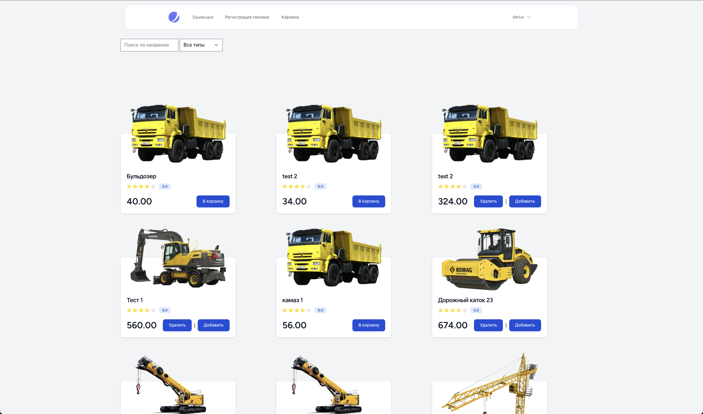
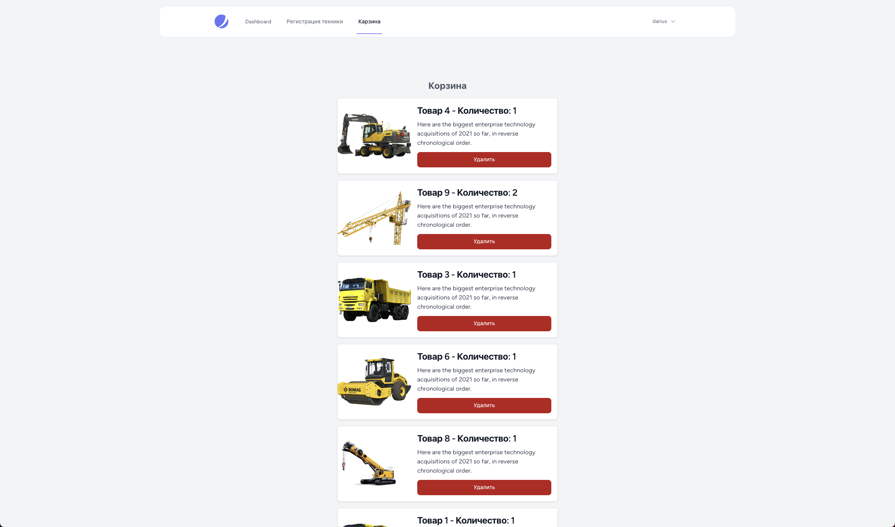

# Building Store Service

Данный репозиторий содержит Laravel приложение интегрированное в общую инфраструктуру поставки Программного комплекса для строительных компаний реализованного на хакатоне Aquarium Building Case. Данный репозиторий включает в себя следующие фукнциональные возможности:




- [x] Создание новой техники
- [x] Отображение каталога техники и ее подбора
- [x] Карзина товаров
- [x] API создания техники
- [ ] API Регистрации статуса техники (обновление координат базирования, арендатора, времени работы) а также возврат
- [ ] Страница просмотра техники


**Техническое описание:**
- Реализуется модель техники хранящая тип данных
- Реализуется таблица учета аренды техники


## API Docs
Для документирования API можно использовать Markdown. Вот пример документации для вашего API:

## Equipment API

### Base URL
```
http://your-domain/api
```

### Endpoints

#### Create Equipment
- **URL:** `/equipment`
- **Method:** `POST`
- **Description:** Создает новое оборудование.
- **Request Body:**
  ```json
  {
    "name": "string (required)",
    "type": "string (required)",
    "price_per_day": "number (required)",
    "description": "string (optional)"
  }
  ```
- **Response:**
    - **Status:** `201 Created`
    - **Body:**
      ```json
      {
        "id": "integer",
        "name": "string",
        "type": "string",
        "price_per_day": "number",
        "description": "string",
        "created_at": "timestamp",
        "updated_at": "timestamp"
      }
      ```
- **Example:**
  ```bash
  curl -X POST http://your-domain/api/equipment \
       -H "Content-Type: application/json" \
       -d '{
             "name": "Excavator",
             "type": "Heavy",
             "price_per_day": 150,
             "description": "A large excavator for construction."
           }'
  ```

#### Get All Equipment
- **URL:** `/equipment`
- **Method:** `GET`
- **Description:** Получает список всего оборудования.
- **Response:**
    - **Status:** `200 OK`
    - **Body:**
      ```json
      [
        {
          "id": "integer",
          "name": "string",
          "type": "string",
          "price_per_day": "number",
          "description": "string",
          "created_at": "timestamp",
          "updated_at": "timestamp"
        },
        ...
      ]
      ```
- **Example:**
  ```bash
  curl -X GET http://your-domain/api/equipment
  ```

#### Get Equipment by ID
- **URL:** `/equipment/{id}`
- **Method:** `GET`
- **Description:** Получает информацию о конкретном оборудовании по его ID.
- **Response:**
    - **Status:** `200 OK` или `404 Not Found`
    - **Body:**
      ```json
      {
        "id": "integer",
        "name": "string",
        "type": "string",
        "price_per_day": "number",
        "description": "string",
        "created_at": "timestamp",
        "updated_at": "timestamp"
      }
      ```
- **Example:**
  ```bash
  curl -X GET http://your-domain/api/equipment/1
  ```

### Response Status Codes
- `200 OK` - Запрос выполнен успешно.
- `201 Created` - Оборудование успешно создано.
- `404 Not Found` - Оборудование не найдено.

### Error Handling
- **404 Not Found:**
  ```json
  {
    "message": "Equipment not found"
  }
  ```

### Request Headers
- `Content-Type: application/json` - Заголовок, указывающий, что тело запроса в формате JSON.

## Примеры запросов

### Создание оборудования
```bash
curl -X POST http://your-domain/api/equipment \
     -H "Content-Type: application/json" \
     -d '{
           "name": "Excavator",
           "type": "Heavy",
           "price_per_day": 150,
           "description": "A large excavator for construction."
         }'
```

### Получение списка оборудования
```bash
curl -X GET http://your-domain/api/equipment
```

### Получение оборудования по ID
```bash
curl -X GET http://your-domain/api/equipment/1
```

Эта документация должна помочь разработчикам быстро понять, как использовать ваше API для создания и получения данных оборудования. Вы можете разместить эту документацию на вашем сайте или в файле README.md в вашем репозитории.
